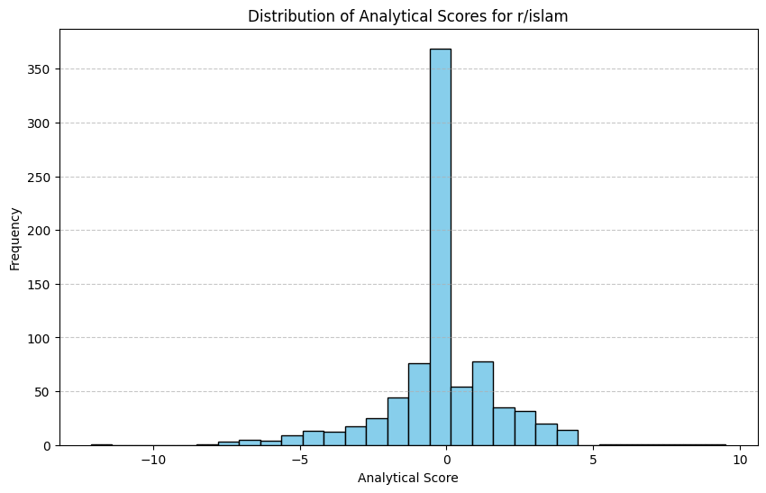

# Text Analysis of Subreddits - Collaborative Project

The purpose of this project is to analyse the differences and similarities between different subreddits existing around a common topic. At first, we will collect Reddit data, analyse TF-IDF scores, and attempt to classify the subreddits using k-means and Naive Bayes algorithms. Then, we will introduce networks to visualise connections between threaded comments and users.


```python
# Setup autoreload
%load_ext autoreload
%autoreload 2

# Create README.md 
# pip3 install nbconvert
# jupyter nbconvert --execute --to markdown RedditTextAnalysis.ipynb
# then rename to README.md
```

## Collecting Reddit Data and EDA


```python
# Import necessary modules
import os
import pickle
import matplotlib.pyplot as plt
import pandas as pd
from config.settings import USER_AGENT
from models.reddit_scraper import RedditScraper
from utils.analysis import *
from datetime import datetime
```


```python
subs_of_interest = ['islam', 'Christianity', 'atheism', 'Buddhism']
```


```python
# scraper = RedditScraper(USER_AGENT)

# subs_of_interest = ['islam', 'atheism', 'Christianity', 'Buddhism']

# results = {} 

# for sub in subs_of_interest:    
#     posts = scraper.get_subreddit_posts(sub, limit=1000, cache=True)
#     posts_df = create_posts_dataframe(posts)
    
#     tfidf_results = tfidf_analyze_subreddit(posts, include_selftext=True)
#     # tfidf_results = tfidf_analyze_subreddit(posts)
#     tf_idf_scores = get_mean_tfidf(
#         tfidf_matrix=tfidf_results['tfidf_matrix'],
#         feature_names=tfidf_results['feature_names'],
#         return_df=True
#     )
#     results[sub] = {"posts_df":posts_df,
#                     "tfidf_results":tfidf_results,
#                     "tf_idf_scores":tf_idf_scores}

# # Ensure the data directory exists
# os.makedirs("data", exist_ok=True)

# # Just a backup of all the files, not used in the analysis directly
# with open("data/results.pkl", "wb") as f:
#     pickle.dump(results, f)
```


```python
# Code to open the pickle
with open("data/results.pkl", "rb") as f:
    results = pickle.load(f)

print(results.keys())
print(results['islam'].keys())
print(results['islam']['posts_df']['selftext'][1])
print(results['islam']['posts_df']['selftext'].value_counts())

```

    dict_keys(['islam', 'atheism', 'Christianity', 'Buddhism'])
    dict_keys(['posts_df', 'tfidf_results', 'tf_idf_scores'])
    I could be in the worst of the worst situations and I read maghrib then POOF its all gone, people who genuinely follow the religion are the best people unlike most people this gen vaping and going to parties thinking its cool.
    selftext
                                                                                                                                                                                                                                                                                                                                                                                                                                                                                                                                                                                                                                                                                                                                                                                                                                                                                                                                                                                                                                                                                                                                                                                                                                                                                                                                                                                                                                                                                                                                                                                                                                                                                                                                                                                                                                         132
    Here is the link to the A Brief Illustrated Guide to Understanding Islam free online book: [https://www.islam-guide.com](https://www.islam-guide.com)                                                                                                                                                                                                                                                                                                                                                                                                                                                                                                                                                                                                                                                                                                                                                                                                                                                                                                                                                                                                                                                                                                                                                                                                                                                                                                                                                                                                                                                                                                                                                                                                                                                                                  4
    We hope you are all having a great Friday and hope you have a great week ahead!\n\nThis thread is for **casual discussion** only.                                                                                                                                                                                                                                                                                                                                                                                                                                                                                                                                                                                                                                                                                                                                                                                                                                                                                                                                                                                                                                                                                                                                                                                                                                                                                                                                                                                                                                                                                                                                                                                                                                                                                                      2
    \n                                                                                                                                                                                                                                                                                                                                                                                                                                                                                                                                                                                                                                                                                                                                                                                                                                                                                                                                                                                                                                                                                                                                                                                                                                                                                                                                                                                                                                                                                                                                                                                                                                                                                                                                                                                                                                     2
    Hello everyone,\n\nI am reaching out for any recommendations for websites/ reading material etc about the Islamic faith.\n\nI am a white male 35 years of age and faith is something I have been lacking in my life and I am looking for something to believe in.\n\nIslam has always been in my mind. Something about it feels , idk just right . I was interested in it on and off since I was around the age of 22.\n\nI never went too far into it because my family is a mixture of Christian Lutheran / or of no faith at all.\n\nIslam just feels right. However I would have to do this journey alone; I’m almost certain my family would not be accepting of me in ragers to this faith.\n\nI am asking all of you for guidance.\n\nWhere should I begin?\n\nI have listened to an audio version of the Holy Quran and it brings me inner peace. Where do I go from here?\n\nMay Allah bless all of you.                                                                                                                                                                                                                                                                                                                                                                                                                                                                                                                                                                                                                                                                                                                                                                                                                                                                                                                      1
                                                                                                                                                                                                                                                                                                                                                                                                                                                                                                                                                                                                                                                                                                                                                                                                                                                                                                                                                                                                                                                                                                                                                                                                                                                                                                                                                                                                                                                                                                                                                                                                                                                                                                                                                                                                                                        ... 
    I have been talking with this boy for 2 years, last summer he blocked me because he had to work on himself. Then in September Allhamdulilah he came back to me. And just 6 days ago we had a small argument and I blocked him out of panic. I miss him and love him so much, and I regret my actions so much. I have done everything in my power to try to contact him but I am not getting a word. He was amazing for me, ands a good muslim and we would always talk about getting married and having a future. So the moment this happened Allah blessed me with the opportunity to get closer with him and I have been praying more often and on time, I pray tahajud, fast, do good deeds, say morning and evening adthkar  and constantly make dua and pray sunnah, for my dua to  be accepted. \n\nI know it's kind of wrong because im supposed to be doing it to get close to Allah, and not to get my dua accepted. But Its so hard, I miss and love him so much. I can't do anything, I have a big aching in my stomach and even if I try to focus on salad and  prayers about other things I can only think about him. I want to be genuine but I can't. I also leanred that Allah said " I am what my servant thinks of me" so if I truly believe that Allah can bring him and me back in connection, it can happen. But I dont know if it's me or the shaitan telling me that it can't happen.  And I also read another muslimah's story and she said something a long the lines of 'Allah won't make me beg and cry for something he won't give me' And that's all I do, beg and cry to Allah for him to come back to me. Im failing school, and I need him. I love Allah, but its so hard to have certainty that Allahrespond and make my dua come true, because I have so many doubts, how do I get rid of that?      1
    Asalamualaykum,\nI am asking if this is permissable or if it is discouraged. I am a sister and I work at a hospital that has a prayer room. Some men pray a jummah prayer together but I don't think there are any other muslim women, who at least can join. If im the only sister there can I pray jummah with them or should I just pray dhuhr on my own either before or after them? It's one large room, not separated by gender.                                                                                                                                                                                                                                                                                                                                                                                                                                                                                                                                                                                                                                                                                                                                                                                                                                                                                                                                                                                                                                                                                                                                                                                                                                                                                                                                                                                                 1
    Salam, \n\nI have an agnostic friend that I discuss religion with.\n\nShe has 2 main problems with Islam.\n\n1- She says the idea of hell is too harsh and gives her anxiety. \n\n2- Religion in general was for an uncivilized time and not necessary anymore \n\nHelp me in my dawah please \n\nJazakallah                                                                                                                                                                                                                                                                                                                                                                                                                                                                                                                                                                                                                                                                                                                                                                                                                                                                                                                                                                                                                                                                                                                                                                                                                                                                                                                                                                                                                                                                                                                           1
    I have seen a few different brothers and sisters making videos on whether Halloween is halal or haram, etc. I’d like to share this I found instead on a Hadith we can all reflect on. Jazak Allah Khair. \n\nAbu Huraira reported: The Prophet, peace and blessings be upon him, said, “Your fire, which the son of Adam ignites, is only one of seventy parts from the fire of Hell.” They said, “By Allah, that would be enough, O Messenger of Allah!” The Prophet said, “Verily, it exceeds it by sixty nine parts, each of which are like its heat.”\n\nSource: Ṣaḥīḥ Muslim 2843\n\nGrade: Sahih (authentic agreed upon) according to Muslim\n\nعَنْ أَبِي هُرَيْرَةَ أَنَّ النَّبِيَّ صَلَّى اللهُ عَلَيْهِ وَسَلَّمَ قَالَ نَارُكُمْ هَذِهِ الَّتِي يُوقِدُ ابْنُ آدَمَ جُزْءٌ مِنْ سَبْعِينَ جُزْءًا مِنْ حَرِّ جَهَنَّمَ قَالُوا وَاللهِ إِنْ كَانَتْ لَكَافِيَةً يَا رَسُولَ اللهِ قَالَ فَإِنَّهَا فُضِّلَتْ عَلَيْهَا بِتِسْعَةٍ وَسِتِّينَ جُزْءًا كُلُّهَا مِثْلُ حَرِّهَا\n\n2843 صحيح مسلم كتاب الجنة وصفة نعيمها وأهلها باب في شدة حر نار جهنم وبعد قعرها وما تأخذ من المعذبين                                                                                                                                                                                                                                                                                                                                                                                                                                                                                                                                                                                                                                                                                                                                   1
    Some people i know use this to commit shirk. Like praying to someone else asking for help other than allah azzawajal. However in this ayah allah azzawajal says take to guardianship in allah, his messenger and beleivers. Im a bit confused. Can someone please provide a correct explanation.                                                                                                                                                                                                                                                                                                                                                                                                                                                                                                                                                                                                                                                                                                                                                                                                                                                                                                                                                                                                                                                                                                                                                                                                                                                                                                                                                                                                                                                                                                                                       1
    Name: count, Length: 817, dtype: int64


## Part 0/ Initial Similarity Analysis: Common Word Use

### Jaccard Similarity Analysis


```python
# Extract the vocabulary for each subreddit
vocabularies = {sub: set(results[sub]['tfidf_results']['feature_names']) for sub in subs_of_interest}

# Get the intersection of the vocabularies
common_vocab = set.intersection(*vocabularies.values())

# Report analytics
print(f"Number of common terms across all subreddits: {len(common_vocab)}")
print(f"Common terms: {', '.join(list(common_vocab)[:10])}...")  # Display first 10 common terms

# Calculate Jaccard similarity for each pair of subreddits
for sub1 in subs_of_interest:
    for sub2 in subs_of_interest:
        if sub1 > sub2:
            intersection = vocabularies[sub1].intersection(vocabularies[sub2])
            union = vocabularies[sub1].union(vocabularies[sub2])
            jaccard_similarity = len(intersection) / len(union)
            print(f"Jaccard similarity between {sub1} and {sub2}: {jaccard_similarity:.3f}")

# Report unique terms for each subreddit
for sub in subs_of_interest:
    unique_terms = vocabularies[sub] - common_vocab
    print(f"Number of unique terms in {sub}: {len(unique_terms)}")
    print(f"Unique terms in {sub}: {', '.join(list(unique_terms)[:10])}...")  # Display first 10 unique terms
```

    Number of common terms across all subreddits: 504
    Common terms: happen, rather, understand, think, past, upon, issue, class, fire, small...
    Jaccard similarity between islam and Christianity: 0.507
    Jaccard similarity between islam and atheism: 0.478
    Jaccard similarity between islam and Buddhism: 0.449
    Jaccard similarity between Christianity and Buddhism: 0.465
    Jaccard similarity between atheism and Christianity: 0.570
    Jaccard similarity between atheism and Buddhism: 0.451
    Number of unique terms in islam: 496
    Unique terms in islam: kindly, positive, dawud, friday, throw, recitation, favorite, basic, suicide, actual...
    Number of unique terms in Christianity: 496
    Unique terms in Christianity: commandment, forever, appear, heavenly, throw, elder, disgust, suicide, actual, creation...
    Number of unique terms in atheism: 496
    Unique terms in atheism: commandment, author, forever, appear, guilt, throw, lock, defend, theist, disgust...
    Number of unique terms in Buddhism: 496
    Unique terms in Buddhism: positive, forever, appear, peaceful, basic, suicide, forth, extreme, special, art...


```python
# Create a dataframe for the common terms
common_terms_df = pd.DataFrame(index=list(common_vocab))

# Add TF-IDF scores for each subreddit
for sub in subs_of_interest:
    common_terms_df[sub] = results[sub]['tf_idf_scores'].reindex(common_vocab)['score']

# Calculate the average TF-IDF score (mean)
common_terms_df['average'] = common_terms_df.mean(axis=1)

# Sort by the average score
common_terms_df = common_terms_df.sort_values(by='average', ascending=False)

# Report the top 5 words
top_10_words = common_terms_df.head(10)
print(top_10_words)
```

                  islam  Christianity   atheism  Buddhism   average
    god        0.010797      0.063861  0.049284  0.005514  0.032364
    like       0.028393      0.035562  0.032741  0.030480  0.031794
    say        0.031983      0.031933  0.034042  0.019651  0.029402
    know       0.031963      0.034275  0.022006  0.026502  0.028687
    people     0.021027      0.027581  0.037505  0.021942  0.027014
    make       0.028106      0.029666  0.026333  0.022021  0.026531
    get        0.026881      0.029330  0.028091  0.021425  0.026432
    want       0.026765      0.029164  0.022911  0.023731  0.025643
    christian  0.007259      0.045291  0.042978  0.004918  0.025112
    feel       0.025264      0.032137  0.017765  0.024555  0.024930


## Part I/ Similarity in Analytical vs. Emotional Thinking?


```python
from utils.analytical_utils import *
```

### 1) Analytical Thinking

- Cosine Distance (Think vs. Feel) -- careful with lemmatisation

- Dictionary (handcrafted) to score analytical thinking


```python
tf_idf_vectors_feel_think = create_tf_idf_vectors(results, subs_of_interest, 'feel', 'think')
print(tf_idf_vectors_feel_think)
```

    {'islam': array([0.02526407, 0.01771909]), 'Christianity': array([0.03213678, 0.02863543]), 'atheism': array([0.01776503, 0.0260029 ]), 'Buddhism': array([0.02455521, 0.02283826])}


```python
plot_subreddit_term_space(tf_idf_vectors_feel_think, 'feel', 'think')
report_distances(tf_idf_vectors_feel_think)
```


    

    


    Distance between Christianity and islam: 0.01
    Distance between Christianity and atheism: 0.01
    Distance between atheism and islam: 0.01
    Distance between Buddhism and islam: 0.01
    Distance between Buddhism and Christianity: 0.01
    Distance between Buddhism and atheism: 0.01
    
    Angles between subreddit vectors:
    Christianity vs islam: 6.7°
    Christianity vs atheism: 14.0°
    atheism vs islam: 20.6°
    Buddhism vs islam: 7.9°
    Buddhism vs Christianity: 1.2°
    Buddhism vs atheism: 12.7°


We now employ a dictionary-based approach to quantify the extent of analytical thinking present in the subreddits' posts.  


```python
# Process subreddit dataframes
islam_df = process_subreddit_subjectivity(results, 'islam')
atheism_df = process_subreddit_subjectivity(results, 'atheism')
christianity_df = process_subreddit_subjectivity(results, 'Christianity')
buddhism_df = process_subreddit_subjectivity(results, 'Buddhism')
```


```python
# Create dictionaries for analytical thinking scale
analytical_words = {
     "assume", "research", "although", "despite", "knowledge", "though", "proof",
    "evidence", "rather", "explain", "regardless", "example", "know", "truth",
    "information", "reason", "explanation", "concept", "think", "however", "meaning",
    "result", "thought", "therefore", "measure", "whereas", "logical", "rational",
    "compare", "contrast", "interpret", "debate"
    }
emotional_words = {
    "really", "hurt", "trust", "worst", "deeply", "concern", "sad", "beautiful",
    "happy", "appreciate", "fight", "depression", "believe", "confused", "comfortable",
    "harm", "worried", "anxiety", "love", "fun", "evil", "feeling", "feel", "fear",
    "heart", "grateful", "regret", "guilty", "care", "hate", "emotional", "comfort",
    "dislike", "desire", "angry", "terrible", "wish"
}
```


```python
scored_islam_df = analyze_and_plot_analytical_score(islam_df, analytical_words, emotional_words, sub_name='r/islam')
scored_atheism_df = analyze_and_plot_analytical_score(atheism_df, analytical_words, emotional_words, sub_name='r/atheism')
scored_christianity_df = analyze_and_plot_analytical_score(christianity_df, analytical_words, emotional_words, sub_name='r/christianity')
scored_buddhism_df = analyze_and_plot_analytical_score(buddhism_df, analytical_words, emotional_words, sub_name='r/buddhism')
```


    

    


    

    


    

    


    

    


```python
summary_stats = compare_analytical_scores(
    subs_of_interest, 
    scored_islam_df, 
    scored_christianity_df, 
    scored_atheism_df, 
    scored_buddhism_df
)
```

                  count      mean       std        min       25%  50%       75%  \
    subreddit                                                                     
    Atheism       704.0 -0.079470  1.528202  -7.377049 -0.701339  0.0  0.554018   
    Buddhism      794.0  0.015529  2.401736 -25.000000 -0.641034  0.0  0.825879   
    Christianity  798.0 -0.272271  2.502813 -25.000000 -1.054823  0.0  0.215286   
    Islam         818.0 -0.082078  1.972027 -12.121212 -0.626959  0.0  0.681484   
    
                        max  
    subreddit                
    Atheism        6.542056  
    Buddhism      22.222222  
    Christianity  18.181818  
    Islam          9.523810  


    /Users/matteolarrode/Documents/Oxford/Fundamentals of Python for SDS/Week 4/FSDS-RedditTextAnalysis/utils/analytical_utils.py:198: FutureWarning: 
    
    Passing `palette` without assigning `hue` is deprecated and will be removed in v0.14.0. Assign the `x` variable to `hue` and set `legend=False` for the same effect.
    
      sns.boxplot(x='subreddit', y='analytical_score', data=combined_df, palette='Set2')


    

    


### 2) Sentiment analysis: Objectivity vs. Subjectivity

- Lexicon based (Pang & Lee, 2004) - nltk.sentiment.util.demo_sent_subjectivity()


```python
avg_subj_islam = islam_df['subjectivity'].mean()
avg_subj_atheism = atheism_df['subjectivity'].mean()
avg_subj_christianity = christianity_df['subjectivity'].mean()
avg_subj_buddhism = buddhism_df['subjectivity'].mean()
```

All subredddits display average subjectivity between 0.45 and 0.47. It looks like the subjectivity / objectivity scale doesn't really pick up on any patterns here.

## Part II/ Similarity in Word Associations

### Plotting Word Similarities #1: MDS


```python
# from utils.analysis import plot_word_similarities_mds

# for sub in subs_of_interest:
#     plot_word_similarities_mds(results[sub]['tfidf_results']['tfidf_matrix'], 
#                                results[sub]['tfidf_results']['feature_names'],
#                                n_terms=20,
#                                title=sub)
#     plt.show()

```

### Plotting the word similarities #2: Using t-SNE


```python
# from utils.analysis import plot_word_similarities_tsne

# for sub in subs_of_interest:
#     fig, ax = plot_word_similarities_tsne(results[sub]['tfidf_results']['tfidf_matrix'], 
#                                      results[sub]['tfidf_results']['feature_names'],
#                                      n_highlight=20,
#                                      title=sub)
#     plt.show();
```


```python
# Import all word association functions
from utils.word_association_utils import *
```

    [nltk_data] Downloading package punkt to
    [nltk_data]     /Users/matteolarrode/nltk_data/...
    [nltk_data]   Package punkt is already up-to-date!
    [nltk_data] Downloading package stopwords to
    [nltk_data]     /Users/matteolarrode/nltk_data/...
    [nltk_data]   Package stopwords is already up-to-date!


```python
# Preprocess and analyze the data
subreddit_of_interest = "Christianity" # ADJUST  for graph title

df = prepare_dataframe(christianity_df) # ADJUST dataframes
target_word = "death"  # ADJUST word of interest
filtered_pairs = calculate_frequencies(df, target_word)

# Plot PMI graph
plot_pmi_graph(filtered_pairs, target_word, subreddit_of_interest)
```

    
    Filtered Word Frequency for 'death':
    death: 76


    

    


## Part III/ ML Classification of Posts


```python
cols = ['author','id','num_comments','score','title','selftext','subreddit']

for name, df in list(globals().items()):
    if name.endswith('_df'):
        if all(col in df.columns for col in cols):
            df = df[cols]
            globals()[name] = df    

df = pd.concat([islam_df, atheism_df, christianity_df, buddhism_df])
```


```python
from sklearn.model_selection import train_test_split
from sklearn.feature_extraction.text import TfidfVectorizer
from utils.classification import *
```


```python
X_text = df['selftext'] + ' ' + df['title']
y = df['subreddit']

X_train, X_test, y_train, y_test = train_test_split(X_text, y, test_size=0.2, random_state=42)
```


```python
tfidf_vectorizer = TfidfVectorizer(
    max_features=1000,
    stop_words='english',
    max_df= 0.85 # ignore terms that appear in more than 85% of the documents
    )

X_train_tfidf = tfidf_vectorizer.fit_transform(X_train)
X_test_tfidf = tfidf_vectorizer.transform(X_test)
```


```python
nb_model = MultinomialNB()
svm_model = LinearSVC(random_state=42)
logreg_model = LogisticRegression(random_state=42)
```


```python
train_and_display_confusion_matrix(nb_model, X_train_tfidf,X_test_tfidf, y_train, y_test, 'Multinomial Naive Bayes')
```


    

    


    ('              precision    recall  f1-score   support\n\n     Atheism       0.78      0.77      0.77       137\n    Buddhism       0.89      0.89      0.89       158\nChristianity       0.73      0.75      0.74       142\n       Islam       0.89      0.88      0.88       186\n\n    accuracy                           0.83       623\n   macro avg       0.82      0.82      0.82       623\nweighted avg       0.83      0.83      0.83       623\n',
     array([[105,   8,  23,   1],
            [  7, 140,   5,   6],
            [ 17,   4, 107,  14],
            [  6,   5,  11, 164]]))


```python
train_and_display_confusion_matrix(svm_model, X_train_tfidf,X_test_tfidf, y_train, y_test, 'Linear SVC')
```


    

    


    ('              precision    recall  f1-score   support\n\n     Atheism       0.74      0.71      0.72       137\n    Buddhism       0.86      0.86      0.86       158\nChristianity       0.68      0.72      0.70       142\n       Islam       0.85      0.83      0.84       186\n\n    accuracy                           0.78       623\n   macro avg       0.78      0.78      0.78       623\nweighted avg       0.79      0.78      0.79       623\n',
     array([[ 97,   7,  24,   9],
            [  9, 136,   8,   5],
            [ 20,   6, 102,  14],
            [  5,  10,  17, 154]]))


```python
train_and_display_confusion_matrix(logreg_model, X_train_tfidf,X_test_tfidf, y_train, y_test, 'Logistic Regression')
```


    

    


    ('              precision    recall  f1-score   support\n\n     Atheism       0.78      0.75      0.77       137\n    Buddhism       0.91      0.91      0.91       158\nChristianity       0.74      0.76      0.75       142\n       Islam       0.87      0.87      0.87       186\n\n    accuracy                           0.83       623\n   macro avg       0.82      0.82      0.82       623\nweighted avg       0.83      0.83      0.83       623\n',
     array([[103,   5,  23,   6],
            [  4, 144,   2,   8],
            [ 20,   3, 108,  11],
            [  5,   7,  13, 161]]))


```python
get_feature_names(nb_model,tfidf_vectorizer,10)
```


<div>
<style scoped>
    .dataframe tbody tr th:only-of-type {
        vertical-align: middle;
    }

    .dataframe tbody tr th {
        vertical-align: top;
    }

    .dataframe thead th {
        text-align: right;
    }
</style>
<table border="1" class="dataframe">
  <thead>
    <tr style="text-align: right;">
      <th></th>
      <th>Atheism</th>
      <th>Buddhism</th>
      <th>Christianity</th>
      <th>Islam</th>
    </tr>
  </thead>
  <tbody>
    <tr>
      <th>0</th>
      <td>god (0.0104)</td>
      <td>buddhism (0.0141)</td>
      <td>god (0.0150)</td>
      <td>allah (0.0130)</td>
    </tr>
    <tr>
      <th>1</th>
      <td>people (0.0088)</td>
      <td>buddha (0.0103)</td>
      <td>jesus (0.0081)</td>
      <td>islam (0.0091)</td>
    </tr>
    <tr>
      <th>2</th>
      <td>religion (0.0086)</td>
      <td>buddhist (0.0085)</td>
      <td>like (0.0070)</td>
      <td>muslim (0.0073)</td>
    </tr>
    <tr>
      <th>3</th>
      <td>atheist (0.0076)</td>
      <td>life (0.0065)</td>
      <td>just (0.0069)</td>
      <td>quran (0.0067)</td>
    </tr>
    <tr>
      <th>4</th>
      <td>religious (0.0075)</td>
      <td>like (0.0061)</td>
      <td>christian (0.0068)</td>
      <td>know (0.0065)</td>
    </tr>
    <tr>
      <th>5</th>
      <td>just (0.0074)</td>
      <td>practice (0.0058)</td>
      <td>bible (0.0066)</td>
      <td>just (0.0058)</td>
    </tr>
    <tr>
      <th>6</th>
      <td>like (0.0066)</td>
      <td>just (0.0053)</td>
      <td>don (0.0063)</td>
      <td>pray (0.0058)</td>
    </tr>
    <tr>
      <th>7</th>
      <td>believe (0.0061)</td>
      <td>know (0.0052)</td>
      <td>know (0.0058)</td>
      <td>like (0.0056)</td>
    </tr>
    <tr>
      <th>8</th>
      <td>don (0.0058)</td>
      <td>ve (0.0049)</td>
      <td>feel (0.0057)</td>
      <td>haram (0.0055)</td>
    </tr>
    <tr>
      <th>9</th>
      <td>church (0.0055)</td>
      <td>meditation (0.0048)</td>
      <td>people (0.0055)</td>
      <td>don (0.0052)</td>
    </tr>
  </tbody>
</table>
</div>


